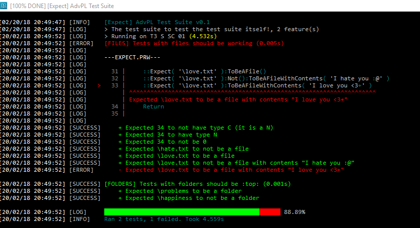
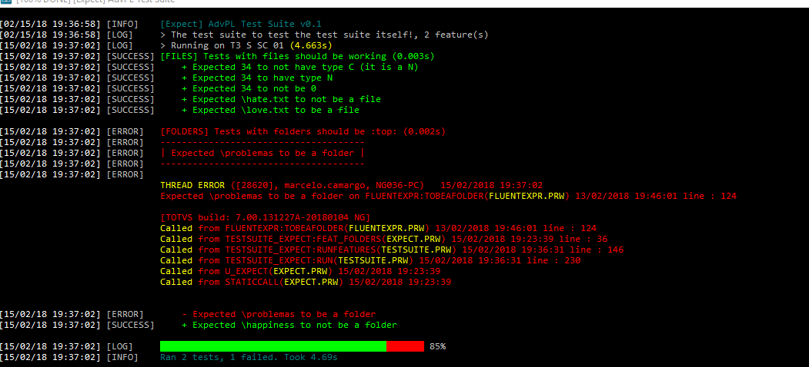
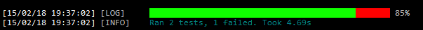

# AdvPL TestSuite

> Mocha + Chai like test suite and light environment for AdvPL

AdvPL TestSuite is an awesome tool to write unit and feature-driven tests for AdvPL
programming language with a lot of utilities and resources to make testing and asserting
correctness less painful. It also provides a cute syntax and support for plugins to make
you happy.



The tests of this tool are also written with itself. You can check it out yourself under
[tests/](./tests) directory.

## Example

```xbase
#include 'protheus.ch'
#include 'testsuite.ch'

TestSuite Files Description 'Having fun with files' Verbose
    Enable Environment 'T3' 'S SC 01'
    Enable Before
    Feature CreateFile Description 'We are able to create and read files'
EndTestSuite

Before TestSuite Files
    If File( '\love.txt' )
        FErase( '\love.txt' )
    EndIf
    Return

Feature CreateFile TestSuite Files
    Local nHandle

    nHandle := FCreate( '\love.txt' )
    FWrite( nHandle, 'I love you <3' )
    FClose( nHandle )

    ::Expect( nHandle ):Not():ToHaveType( 'C' )
    ::Expect( nHandle ):ToHaveType( 'N' )
    ::Expect( nHandle ):Not():ToBe( 0 )
    ::Expect( '\hate.txt' ):Not():ToBeAfile()
    ::Expect( '\love.txt' ):ToBeAFile()
    ::Expect( '\love.txt' ):Not():ToBeAFileWithContents( 'I hate you :@' )
    ::Expect( '\love.txt' ):ToBeAFileWithContents( 'I love you <3' )
    Return

CompileTestSuite Files
```

Run it with `U_FILES` and check your _AppServer_.

## Features

### Error line highlighting and stack inspection

We inspect the stack to locate the file where the error really happened, then we try
to find the original filename in the bytecode of the resource, so we open, tokenize
and render it to you like a charm!
When this is not possible, we fallback for the highlighted stack.



### Company and branch

You can enable the `Environment` plugin to start your tests positioned in a company and
a branch. Just add `Enable Environment <enterprise> <branch>` and you are done. This is
required if you are going to work with the database.

### Verbose mode

Enabling the verbose mode also enables the percentage bar of tests that are failing and
passing. You can do it by appending `Verbose` after the description of your test suite.



Expectations will be logged line by line, this makes debugging and finding the error a lot
easier.

Either in verbose mode or not, you can see how many seconds each feature and the test suite at
all took to run. This is very useful for profiling and finding performance issues.

### Before running

You can enable the `Before` plugin to clean up the environment before running your tests. This
may be useful for things such as deleting old files to ensure the environment where your tests
will run will not affect them.

### Frozen database

There is automatic support for database restoration without having to do this manually. We use
and discard transactions to ensure the changes we do will not be committed to the database.
Don't worry, you can do everything you would do and your data will continue to exist from
feature to feature, but every destructive update will be restored at the end of the session.

### Fluent expectations

TODO

## Installation

Installing AdvPL TestSuite is quite simple!

- Download [include/testsuite.ch](./include/testsuite.ch) and move it to your _includes_ directory
- Download and compile all the files under [src/](./src/) directory

And you are done!
